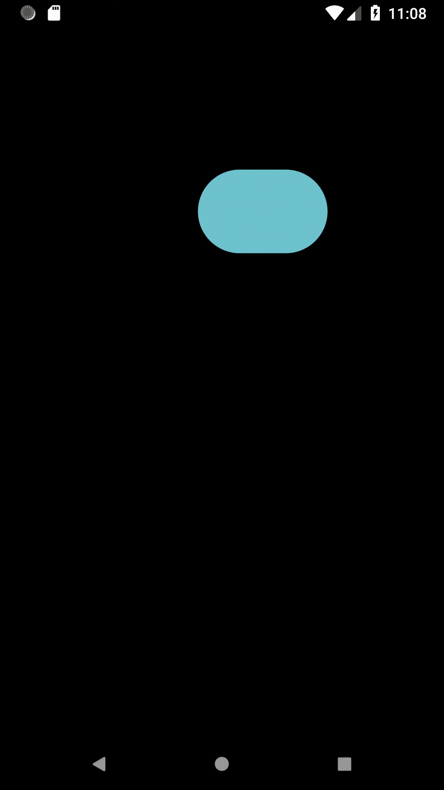
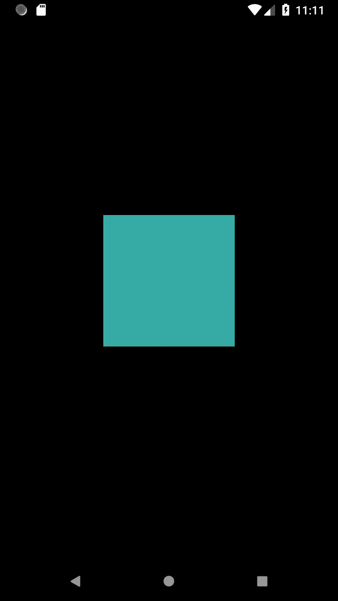
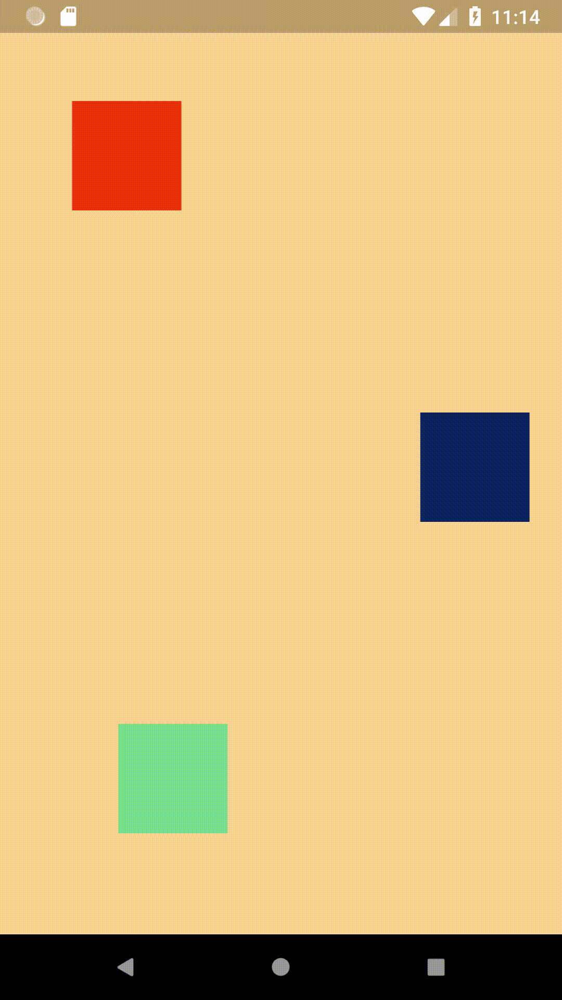
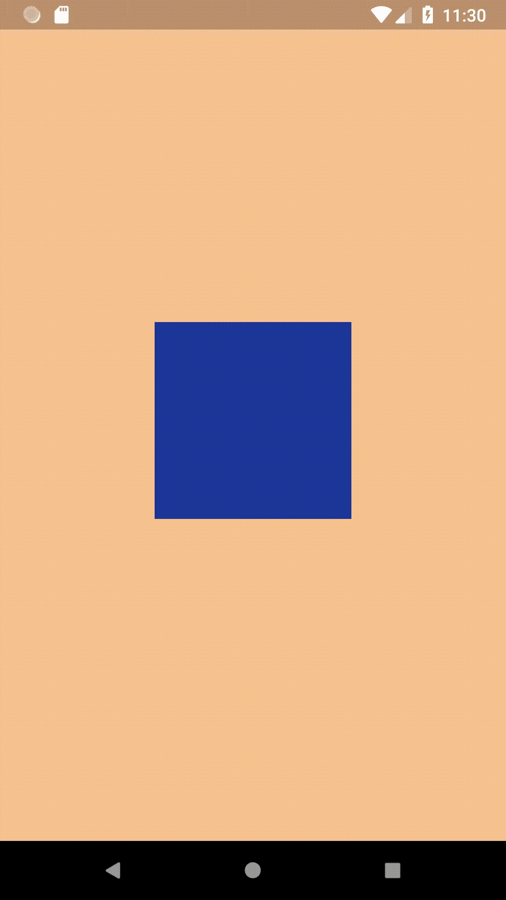
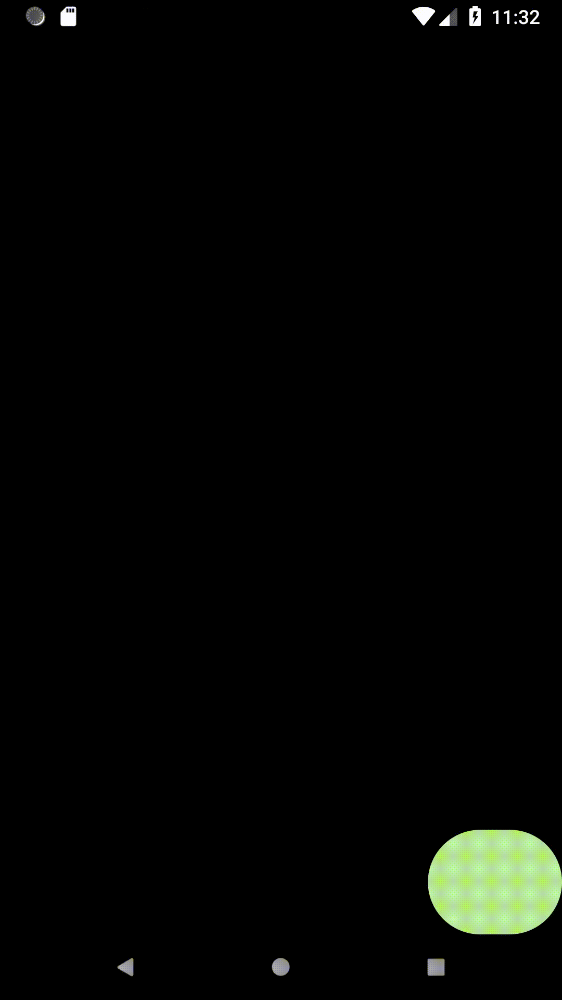
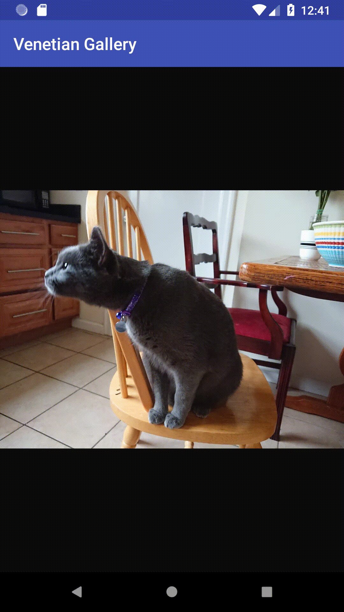

# DevFest '18 Playground

This repo contains the code from my live-coding session at DevFest Lagos 2018 (on the basics of
animation with Flutter and embedding Flutter widgets in Android apps).

The `flutter_animation_basics` folder is a Flutter module containing a series of examples that 
demonstrate various animation concepts and a widget that transitions between images with a Venetian
blinds-like animated effect. `app` contains a regular Android app that employs that widget to cycle
through the last ten images on a user's device.

| | |
|:-------------------------:|:-------------------------:|
 
[A box that implicitly animates its properties](flutter_animation_basics/lib/01_implicit_animations/main.dart)
 |  
[A box that expands and contracts through an explicitly controlled animation](flutter_animation_basics/lib/02_explicit_animations/main.dart)

 
[Three boxes whose positions are animated by the same controller but with different curved interpolations](flutter_animation_basics/lib/04_curves/main.dart)
 |  
[Declaratively animating background color and gradient with tweens](flutter_animation_basics/lib/05_tweens/main.dart)

 
[A box that both shrinks and starts rotating when pressed](flutter_animation_basics/lib/06_multiple_animations/main.dart)
 |  
[A box that changes its properties starting at different points of the entire animation duration](flutter_animation_basics/lib/07_staggered_animations/main.dart)

 
[A view that transitions between images on tap](flutter_animation_basics/lib/venetian_image_view/image.dart)
 |

## You will need:

- Android Studio (or at least the SDK, if you're comfortable using it from the command line)
- The Flutter SDK (you can grab that [here](https://flutter.io/docs/get-started/install))
